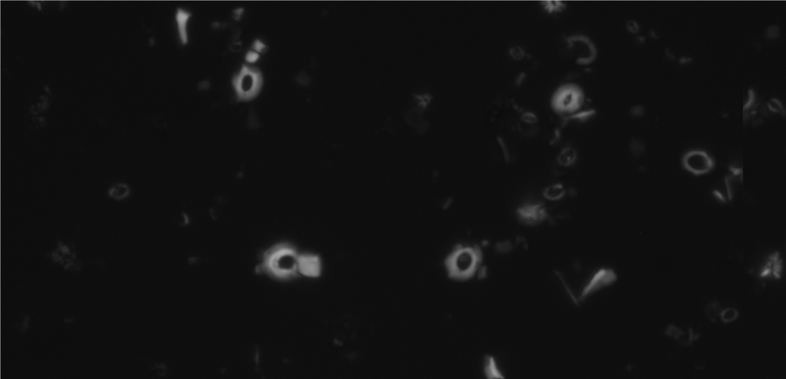

# ImgClassification

A simple package designed to do the following:
- Receive a greyscale image containing multiple features of roughly the same size, and pick out these features
- Present the features one-by-one for manual classification with a single key press
- Train a small ConvNet to classify the images

Instructions for initial set up
- Download the repo (using the green code button and selecting download as zip, or use git clone)
- Run install.py which will create the necessary folder structure and install requirements such as pytorch, pandas and opencv

Instructions for use
1. Paste input image into imgs/ (this is part of Original_Halved.tif)

2. Run main.py, setting the following values (found near top of file)
```python3
thresholding_level = 25 #Where to threshold the image (0-255)
min_side = 15 #Smalleset side of possible feature to consider a feature
max_side = 200 #Biggest side of feature to consider it a feature
border = 5 #How much to add around the feature
img_name = 'testimg.tif' #Image name (don't add preceding img/)
batch_name = 'test' #An optional indicator for a particular run
threshold_mode = 'mg' #'mg' or 'bi'
save_noclass = True
```
3. Run label.py, setting the following values (found near top of file)
```python3
img_name = 'testimg.tif' #Name of image in imgs/
batch_name = 'test' #Must be consistent with batch used in main.py
username = 'usr' #The user (another optional indicator for the particular run), in case multiple people want to label to check fro consistency
figsize = 5 #How big you want the matplotlib display window (size in inches, 5 recommended)
```

4. Open neural_network, and run train.py, setting the following values (found near top of file)
```python3
epochs=100 #How long to train for
model_path = './models' #Where to save models
model_no = 0 #In case you want to train more than once and compare models (model comparison not currently implemented)
loss = 'CE' #Cross entropy loss used, would recommend sticking with this
img_name = 'testimg.tif' #Name of input image in imgs/
batch_name = 'test' #Must be consistent with batch_name used above
username = 'usr' #Must be consistent with username above
bc_jitter = False #Introduces a small amount of brightness-contrast jitter
schedule = True #Leave True, uses a learning rate scheduler.
```

5. Paste new image for classification in, open neural_network, and run eval.py, setting the following values (found near top of file)
```python3
#Specifies image to test with
img_name = 'ex1.tif'

#Location of models
model_path = './models' #Same location as above

#Specify either these parameters to point to the correct model
model_no = 0
batch_name = 'test'
username = 'usr'
train_image_name = 'train1.tif'
#Or specify model name exactly (leave like model_name = '' to use above parameters)
model_name = ''

num_classes = 3
```
These images will be saved into a new folder called, into num_classes subfolders. If the network has learned well, then this will accurately reflect the true classifications!
```python3
data_folder_out = f'classified_png/{batch_name}_{img_name}_{username}_{model_no}/'
```


